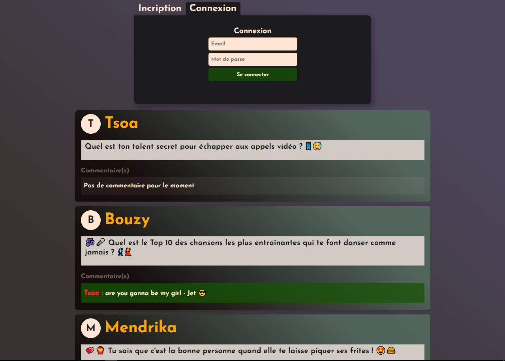
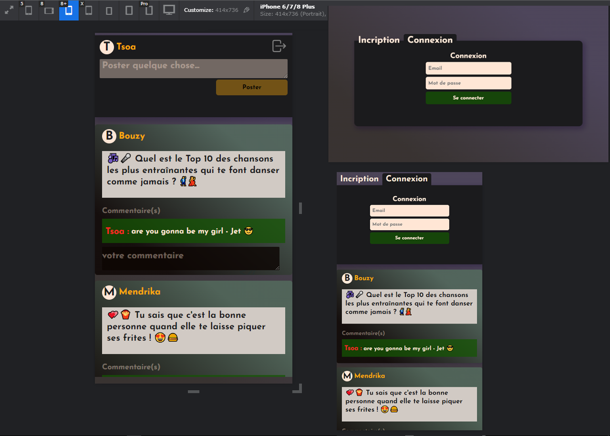

# PostYeah

This project demonstrates how to set up and run both backend frontend of a PostYeah application using the MERN stack (MongoDb, Express.js, React, Node.js).

## Prerequisites

Make sure You have Node.js and MongoDB installed on your machine before you start.

## installation

### Backend

1. Navigate to the backend folder: `cd backend`
2. Install dependencies: `npm install`
3. Launch the server: `npm start`

### Frontend

1. Navigate to the frontend folder: `cd frontend`
2. Install dependencies: `npm install`
3. Launch the server: `npm run dev`

## Usage

Once both the backend and frontend servers are running, open your browser and access the frontend URL to interact with the application.

## Screenshots

## Personal Project

This repository is a personal project showcasing my skills in building a postYeah application with the MERN stack.

## Author

RAJAONSON Tolotriniavo Henintsoa (RaNii Johnson)

---

Feel free to further customize the content according to your project and the specific information you want to include.
